# 🧠 N8N Mindmap — Từ Cơ Bản Đến Chuyên Sâu

> **Phiên bản:** May 2026 · **Tác giả:** Cong Dinh
> **Mục đích:** Khung kiến thức training, consulting, brand building
> **Đối tượng:** Mixed track — Business + Technical

---

## 📌 Cách dùng file này

- **Render Mermaid:** GitHub, GitLab, Notion, Obsidian, Typora, VS Code (extension Mermaid Preview), HackMD
- **Export PNG/SVG:** Mermaid Live Editor — `https://mermaid.live`
- **Track filtering:** Mỗi nhánh có badge `[🏢 BIZ]`, `[⚙️ TECH]`, hoặc `[🎯 MIX]`

---

## 🗺️ Mindmap chính (Tổng quan)

```mermaid
mindmap
  root((n8n<br/>Fair-code<br/>Workflow Automation))
    1. Foundations 🎯
      n8n là gì
        nodemation
        186k+ GitHub stars
        Fair-code license
      So sánh
        vs Zapier (cloud only)
        vs Make (visual UX)
        vs Power Automate (MS eco)
      Kiến trúc
        Editor UI
        Workflow Engine
        Database
        Task Runners
        Queue Redis
      Use cases tổng quan
        Business
        Personal
        AI
        Data ETL
    2. Installation ⚙️
      n8n Cloud
        Managed SaaS
        14-day trial
      Docker Compose
        Phổ biến nhất
        Postgres + Redis
        Nginx Traefik
      npm install
        Dev only
      Kubernetes
        Helm chart
        HPA autoscale
      Cloud Providers
        AWS ECS EKS
        Azure Container Apps
        GCP Cloud Run
        VPS Hetzner Contabo
    3. Core Concepts 🎯
      Workflows
        Lifecycle Draft Active
        JSON structure
        Tags Folders
      Nodes
        Trigger nodes
        Action nodes
        Logic nodes
        500+ built-in
      Connections
        Main
        Error
        AI Tool Memory Model
      Data Structure
        Items array
        json binary pairedItem
      Credentials
        OAuth2 API key
        AES-256 encryption
        External secrets
      Triggers
        Schedule cron
        Webhook
        App push poll
        Form
      Executions
        Status modes
        Retention policy
    4. Expressions & Code ⚙️
      Syntax {{ }}
        $json $input
        $now $workflow
        $env $execution
      Built-in helpers
        Luxon DateTime
        Array map filter
        JMESPath
        Crypto
      Code Node JS
        Run all vs each
        Built-in libs
      Code Node Python
        Pyodide runtime
      HTTP Request
        Auth methods
        Pagination
        Retry backoff
    5. Patterns & Errors ⚙️
      Design Patterns
        Sequential
        Conditional IF Switch
        Fan-out parallel
        Fan-in merge
        Loop Over Items
        Wait Delay
        Circuit Breaker
      Sub-workflows
        Execute Workflow
        DRY reusability
      Error Handling
        Error Trigger
        Continue On Fail
        Stop and Error
      Retry Logic
        Exponential backoff
        Idempotency
        Dead letter queue
      Debugging
        Pin data
        Step execution
        Console log
    6. AI & LangChain 🎯
      n8n 2.0 Jan 2026
        70+ AI nodes
        75% customers use AI
      LLM Providers
        OpenAI GPT-4 o1
        Anthropic Claude
        Google Gemini
        Ollama Hugging Face
        Groq Mistral
      AI Agents
        ReAct
        Tools agent
        OpenAI Functions
        Conversational
      Memory Types
        Buffer
        Window
        Summary
        Vector store
      RAG Pipeline
        Vector stores Pinecone Qdrant pgvector
        Embeddings
        Document loaders
        Splitters
        Retrieval similarity MMR
      Multi-Agent
        Supervisor
        Worker specialized
        Coordination
      AI Use Cases
        Support chatbot RAG
        Document processing
        Content generation
        Lead qualification
        Voice agents Vapi
      Evaluation
        Eval nodes
        LLM-as-judge
        Guardrails
    7. Production ⚙️
      Queue Mode
        Less 1k exec standard
        1k-10k 1 worker
        10k+ multi workers
      Architecture
        Main process
        Workers Redis pull
        Webhook processors
        Postgres required
      Critical Config
        EXECUTIONS_MODE queue
        ENCRYPTION_KEY identical
        QUEUE_BULL_REDIS_HOST
        Concurrency limit
      Resource Planning
        200-500MB per worker
        Node heap size
        Binary filesystem mode
        DB retention
      Monitoring
        Prometheus metrics
        Health checks
        Centralized logging
        Grafana alerts
      Backup DR
        pg_dump daily
        Workflow export Git
        Credentials encrypted
        Binary S3
      Kubernetes
        HPA Redis depth
        Pod separation
        PVC StatefulSet
        Network policy
    8. Enterprise 🏢
      CRM Sales
        Lead capture score
        Pipeline sync bi-direction
        Quote DocuSign
        Follow-up sequence
      Marketing
        Email drip
        Cross-platform social
        Lead nurturing
        Unified analytics
      HR
        Onboarding accounts
        Offboarding revoke
        Leave approval
        Performance review
      Finance
        Invoice auto
        Reconciliation
        Expense OCR
        Revenue dashboard
      Customer Support
        Ticket routing AI
        SLA monitoring
        AI first response
        CSAT survey
      Data ETL
        Source staging warehouse
        Schedule batch
        CDC incremental
        Validation
    9. Personal 🏢
      Email Inbox Zero
        Auto-classify
        Auto-reply context
        Daily digest AI
        Action extraction
      Social Media Brand
        Idea to publish pipeline
        Cross-posting adapt
        Analytics
        Engagement
      Personal Finance
        SMS bank parse
        Budget alert
        Investment tracking
        Crypto alerts
      Learning
        RSS YouTube curation
        Reading list TLDR
        Anki flashcards
        Course progress
      Home IoT
        Home Assistant
        Doorbell photo
        Morning briefing
    10. Best Practices 🎯
      Naming
        Workflow Team Purpose Trigger
        Node action-based
        Tags domain env
        Sticky notes
      Security
        Least privilege creds
        Encryption key 32+ chars
        HTTPS force
        Webhook HMAC
        RBAC
        Audit log
        Rotation 90 days
      Performance
        Batch 100 items
        Binary filesystem
        Pagination built-in
        Cache Redis
        Rate limiting Wait
        Concurrency control
      Reliability
        Idempotency
        Error workflow alert
        Timeout always
        Circuit breaker
        Monitoring Slack
      Testing
        Pin sample data
        Staging env
        Schema validation
        AI eval suite
      Version Control
        CLI export Git
        Source Control feature
        CI lint deploy
        Tag releases
      Documentation
        Sticky notes Why
        Runbook link
        External docs Notion
    11. Case Studies 🎯
      Delivery Hero
        200h month saved
        Single workflow
      Vodafone
        5000 person-days year
        33 workflows incident
      Musixmatch
        47 days engineering
        4 months
      StepStone
        25x faster integration
        Data ingestion
      TechStore.vn
        Order fulfillment
        80 percent auto
      CloudMetrics.io
        Queue mode 4 workers
        50k exec day
      ROI metrics
        240 percent average
        3.7 dollar return per 1
        10-15k saved monthly
    12. Troubleshooting ⚙️
      Installation
        Permission Docker UID
        Port conflict 5678
        DB connection
        SQLite lock
      Execution Errors
        undefined json
        Timeout config
        Out of memory
        Rate limit 429
      Webhook
        Not registered
        WEBHOOK_URL config
        HTTPS cert
        Body parsing
      Queue Mode
        Jobs stuck
        Credential decrypt
        Webhook slow
        Memory leak
      Debugging
        Execution logs
        Pin data
        Console log
        curl test
    13. Ecosystem 🎯
      Official
        docs.n8n.io
        Templates 5000+
        Community forum
        GitHub repo
        YouTube
      Community Nodes
        Self-hosted only
        Vector DB nodes
        Niche APIs
      Custom Nodes
        TypeScript
        n8n-nodes- npm
        Local link test
      Career Opportunities
        Freelance 50-150 hour
        Agency 25k+ month
        Training consulting
        Templates marketplace
      Learning Path
        Week 1-2 Foundation
        Week 3-4 Code Errors
        Week 5-6 AI RAG
        Week 7-8 Production
        Week 9-12 Real project
```

---

## 🌳 Mindmap chi tiết theo từng nhánh

### Nhánh 1: Foundations — Nền tảng [🎯 MIX]

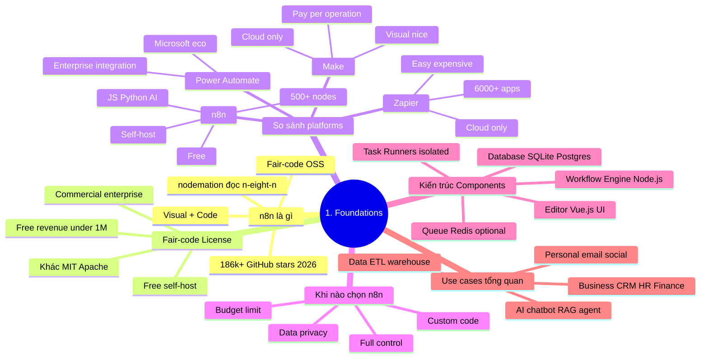

### Nhánh 2: Installation & Setup [⚙️ TECH]

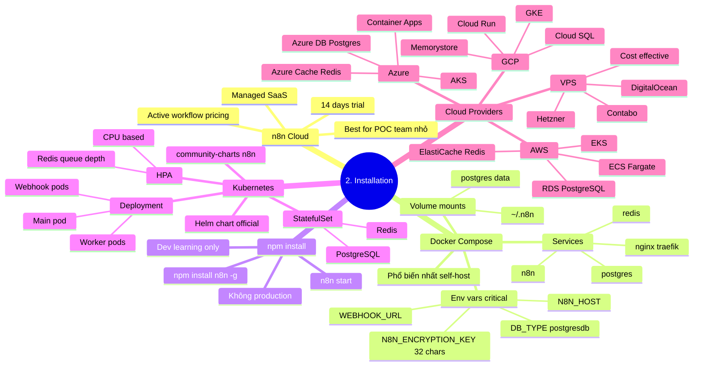

### Nhánh 3: Core Concepts [🎯 MIX]

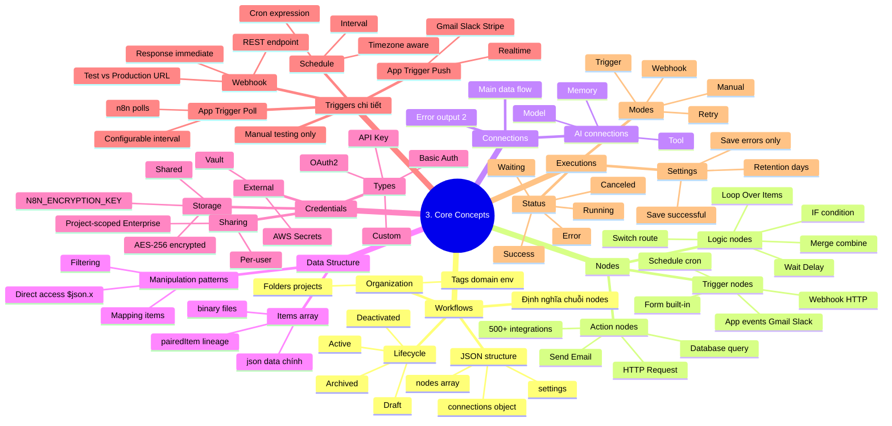

### Nhánh 4: Expressions & Code Node [⚙️ TECH]

```mermaid
mindmap
  root((4. Expressions & Code))
    Expression Syntax
      {{ expression }}
      JavaScript template literals
      Current item
        $json.field
      First all items
        $input.first().json.x
        $input.all()
      Other nodes
        $('Node Name').item.json.x
      Variables
        $now $today
        $workflow
        $execution
        $env
    Built-in Helpers
      Date Time Luxon
        $now.plus({days: 7})
        .format('yyyy-MM-dd')
        .diff()
      String
        toUpperCase
        replaceAll
        split
        trim
      Array
        map filter reduce
        sort find
        slice flat
      JMESPath query
        $jmespath syntax
      Crypto
        hash uuid
        randomBytes
    Code Node JavaScript
      2 modes
        Run Once for All
        Run Once for Each
      Return shape
        Array of json items
      Built-in libs
        crypto
        axios limited
        lodash
      External modules
        NODE_FUNCTION_ALLOW_EXTERNAL
      Best practice
        Khi expression quá phức tạp
        Easy test maintain
    Code Node Python
      Pyodide runtime
      Slower than JS
      Limited libs
      Data science use case
    HTTP Request Deep
      Authentication
        None
        Basic
        Header
        OAuth2
        Bearer
        Custom
      Pagination handlers
        Offset
        Page number
        Link header
        Next URL
      Retry
        Configurable retries
        Exponential backoff
      Streaming
        Binary data
        SSE
```

### Nhánh 5: Workflow Patterns & Error Handling [⚙️ TECH]

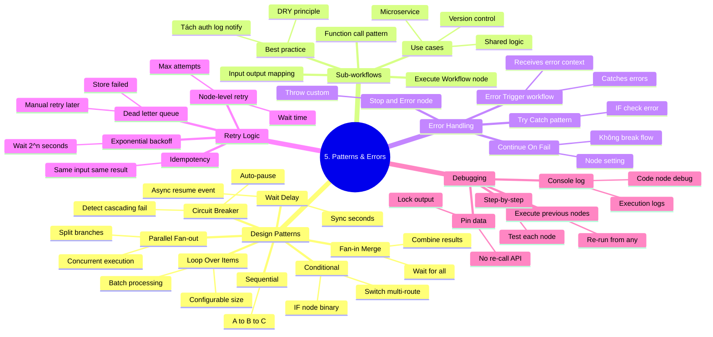

### Nhánh 6: AI & LangChain [🎯 MIX — HOT 2026]

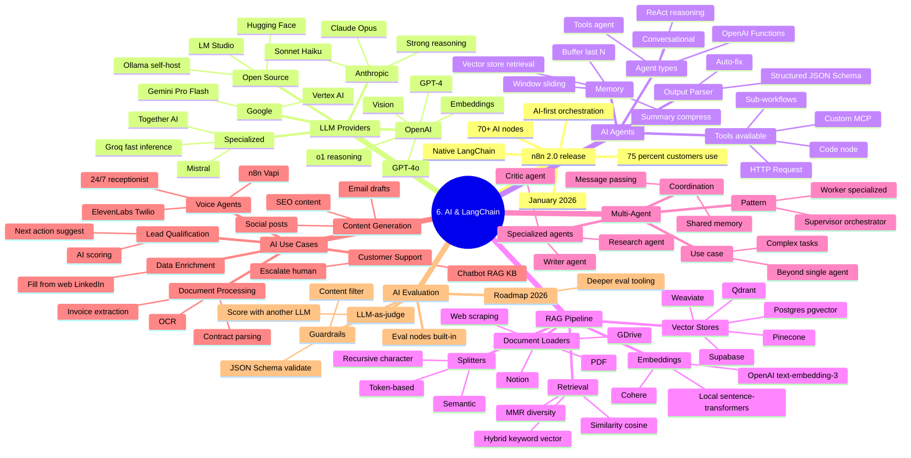

### Nhánh 7: Production & Scaling [⚙️ TECH]

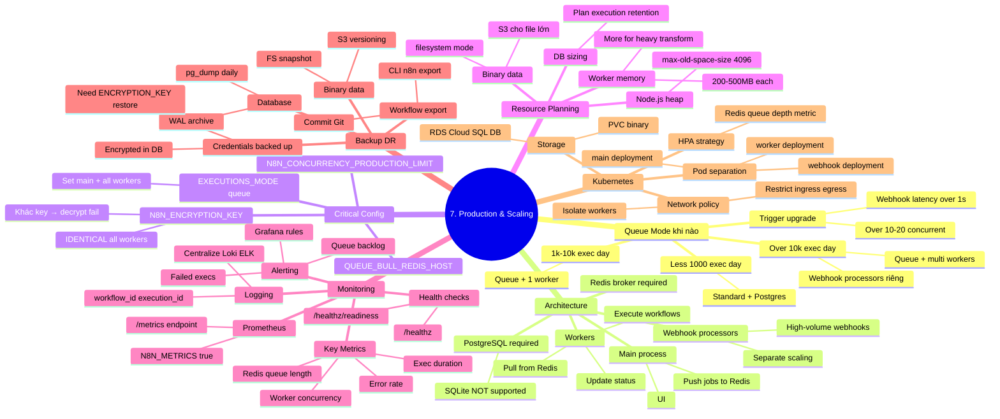

### Nhánh 8: Enterprise Use Cases [🏢 BIZ]

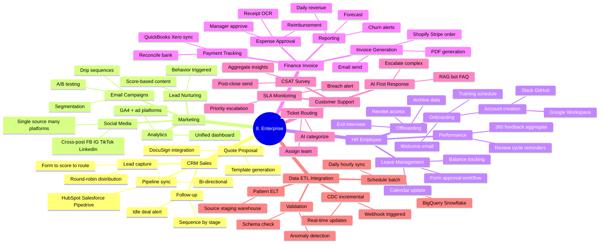

### Nhánh 9: Personal Productivity [🏢 BIZ]

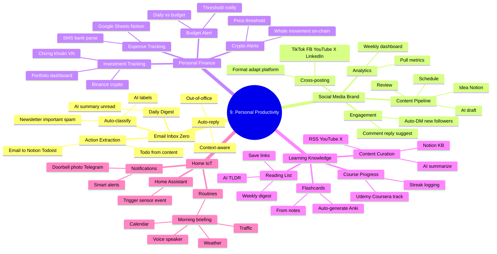

### Nhánh 10: Best Practices [🎯 MIX]

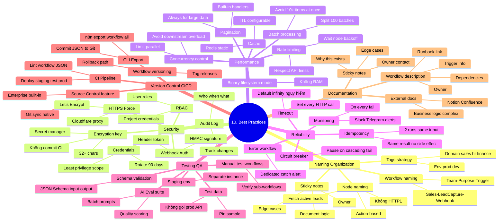

### Nhánh 11: Case Studies — Real-world ROI [🎯 MIX]

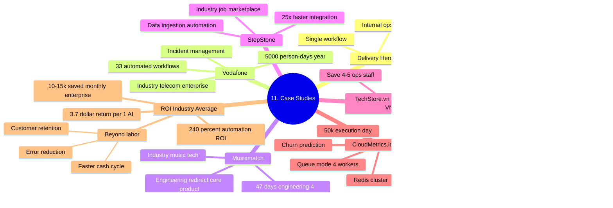

### Nhánh 12: Troubleshooting [⚙️ TECH]

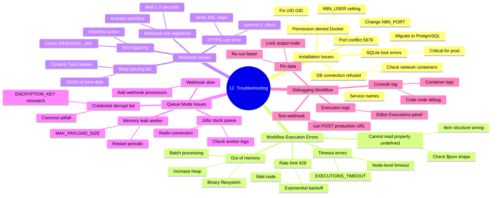

### Nhánh 13: Ecosystem & Career [🎯 MIX]

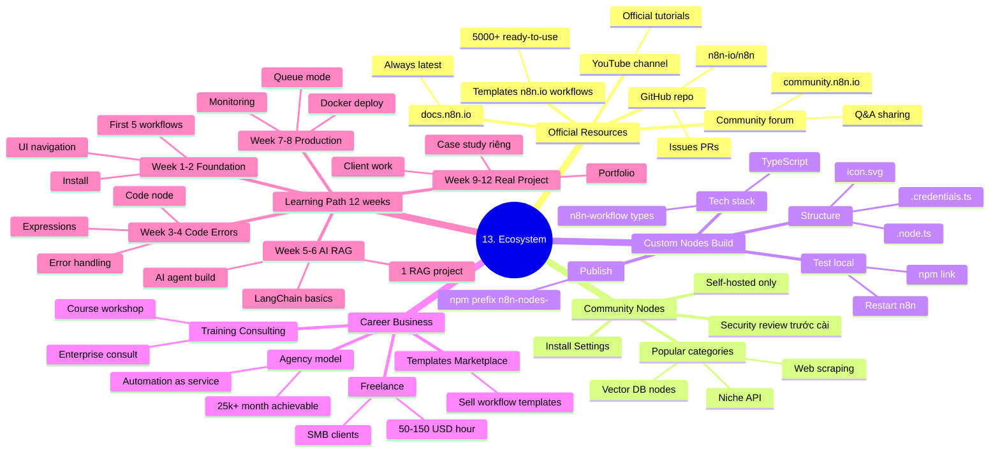

---

## 🎯 Learning Paths theo đối tượng

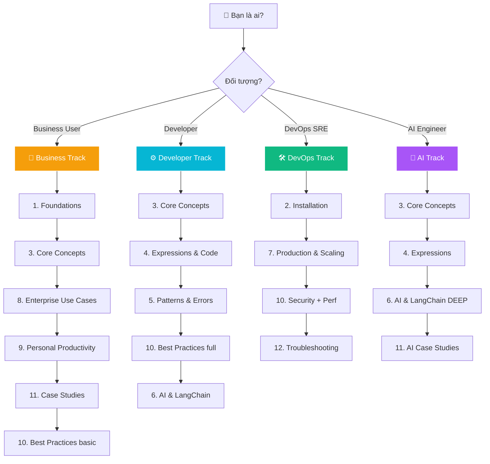

---

## 📚 Reference — Cheatsheet nhanh

### Critical Environment Variables

| Variable | Mục đích | Bắt buộc |
|----------|----------|----------|
| `N8N_ENCRYPTION_KEY` | Encrypt credentials (32+ chars) | ✅ Có |
| `DB_TYPE=postgresdb` | PostgreSQL production | ✅ Có |
| `N8N_PROTOCOL=https` | Force HTTPS | ✅ Có |
| `WEBHOOK_URL` | Public webhook URL | ✅ Webhook |
| `EXECUTIONS_MODE=queue` | Queue mode | ✅ Scale |
| `QUEUE_BULL_REDIS_HOST` | Redis broker | ✅ Queue |
| `N8N_METRICS=true` | Prometheus endpoint | 🟡 Khuyến nghị |
| `GENERIC_TIMEZONE` | Default TZ | 🟡 Khuyến nghị |

### Common Expressions

```javascript
// Access data
{{ $json.field_name }}
{{ $input.first().json.field }}
{{ $('Node Name').all() }}

// Date/time
{{ $now.format('yyyy-MM-dd') }}
{{ DateTime.fromISO($json.date) }}

// Operations
{{ $input.all().map(item => item.json.name) }}
{{ $input.all().filter(item => item.json.status === 'active') }}
{{ $input.all().reduce((sum, item) => sum + item.json.amount, 0) }}
```

### CLI essentials

```bash
# Start n8n
docker-compose up -d

# View logs
docker-compose logs -f n8n

# Export all workflows
n8n export:workflow --all --output=./workflows/

# Test webhook
curl -X POST https://n8n.domain.com/webhook/test \
  -H "Content-Type: application/json" \
  -d '{"test": true}'

# Backup database
docker-compose exec postgres pg_dump -U n8n n8n > backup.sql
```

---

## 🔗 Sources & References

- [n8n Official Docs](https://docs.n8n.io)
- [n8n Blog](https://blog.n8n.io)
- [Queue Mode Configuration](https://docs.n8n.io/hosting/scaling/queue-mode/)
- [AI Agents Guide 2026](https://blog.n8n.io/ai-agents-examples/)
- [n8n Case Studies](https://n8n.io/case-studies/)
- [Community Forum](https://community.n8n.io)
- [GitHub Repository](https://github.com/n8n-io/n8n)
- Docs nội bộ workspace: `/docs` (21 files)

---

**Phiên bản:** 1.0 · **Last updated:** May 18, 2026 · **License:** Personal use
